# laravel_music_app
 
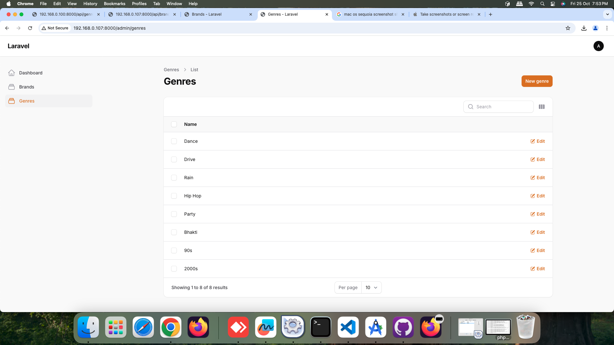
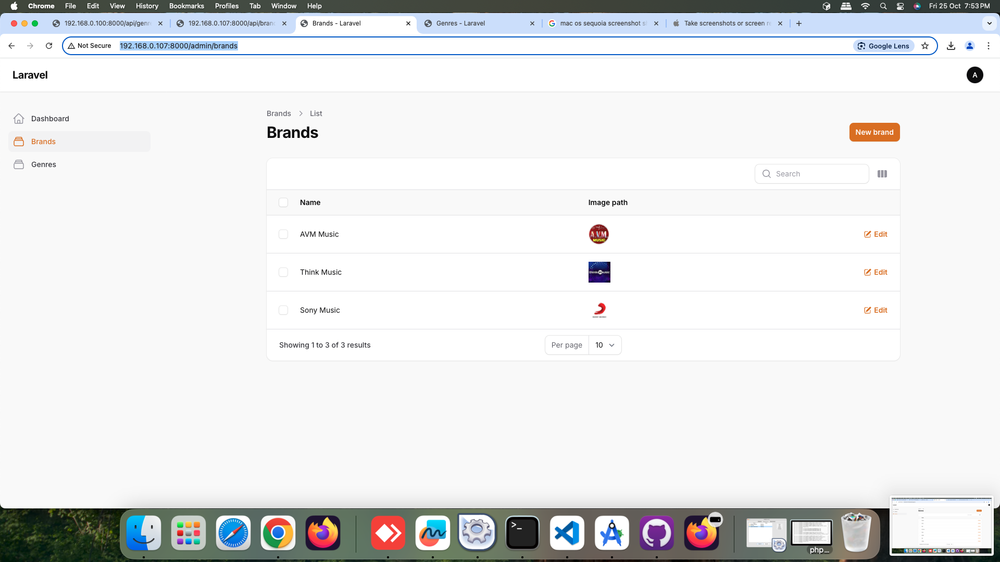
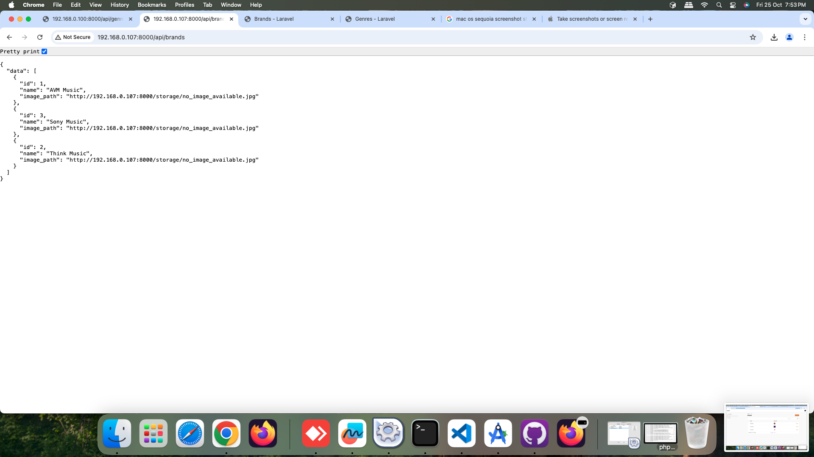
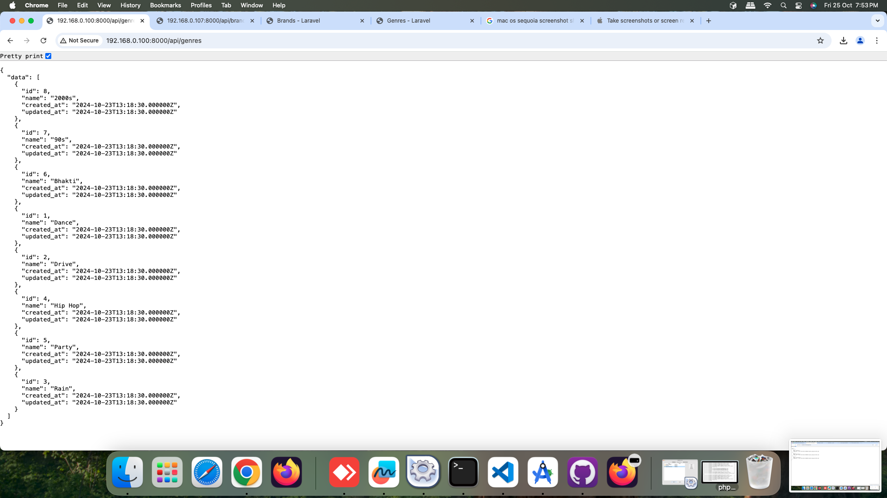
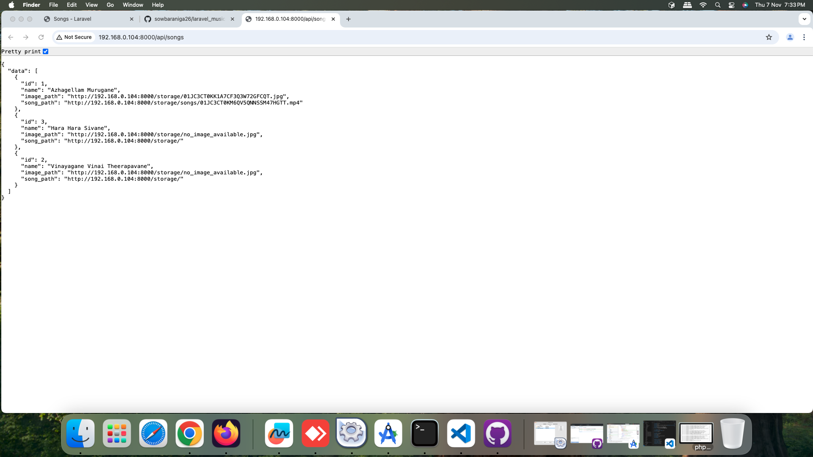
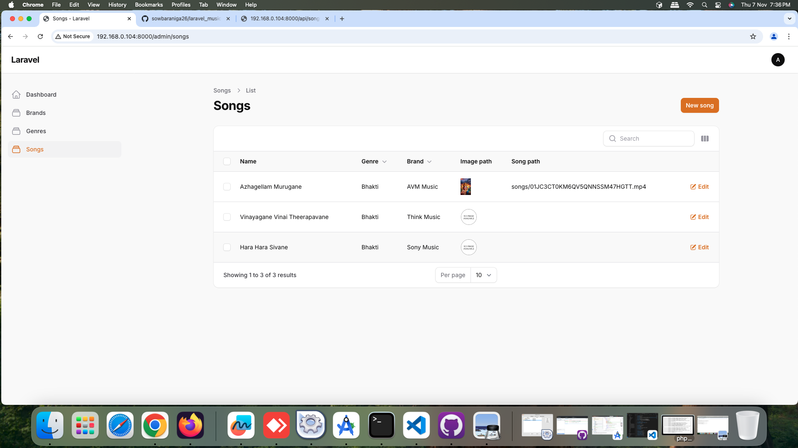
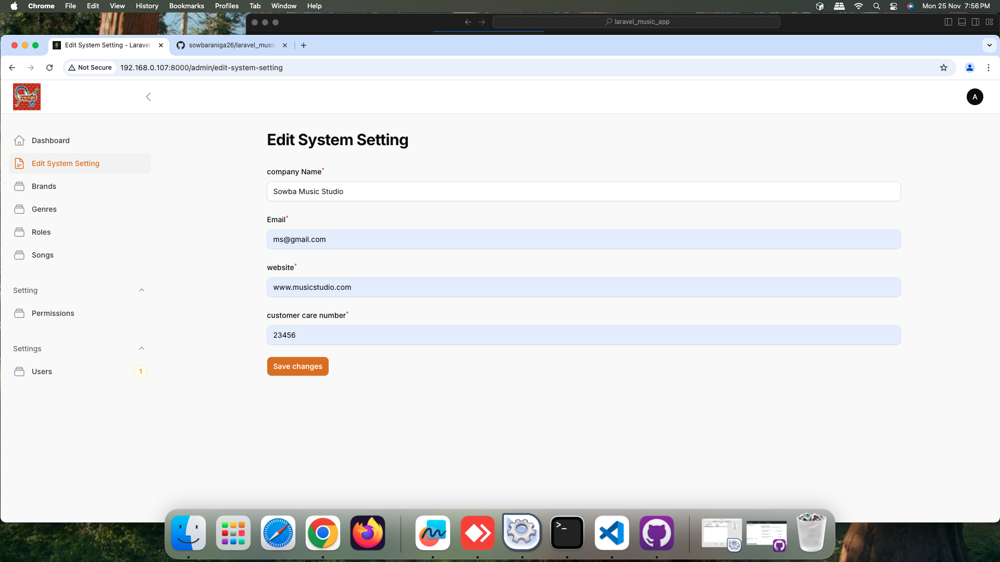
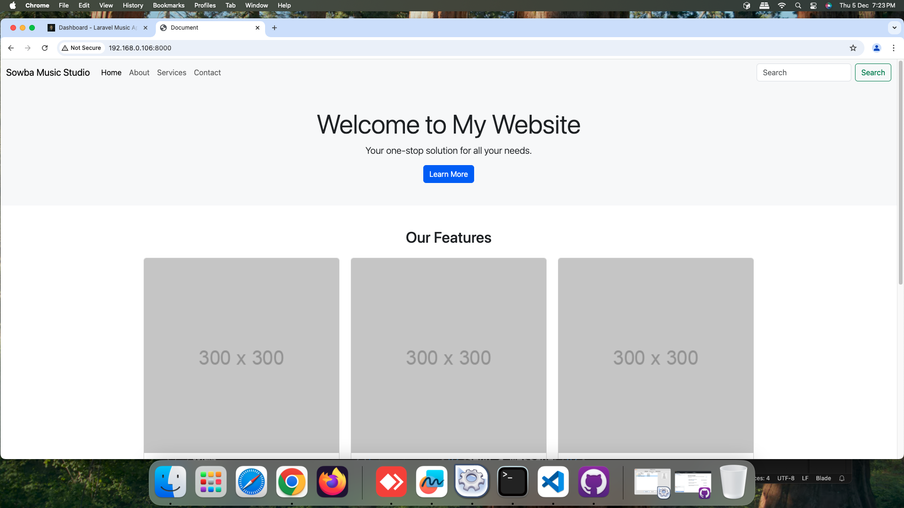
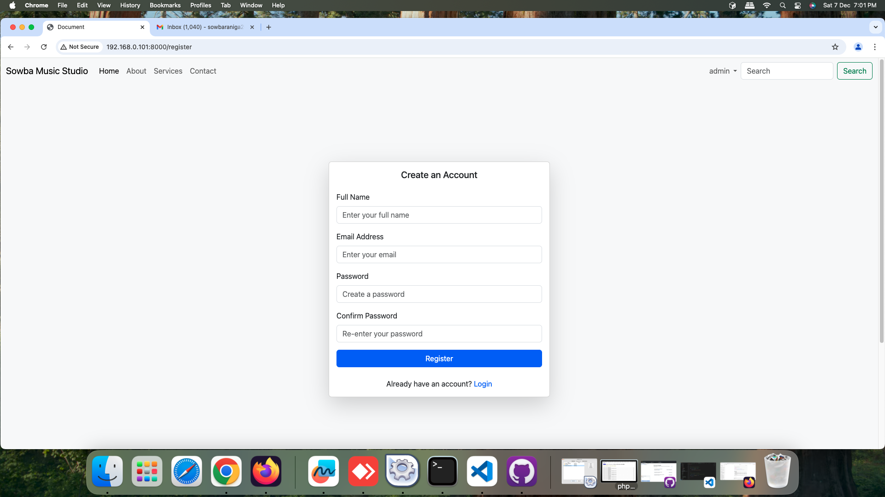
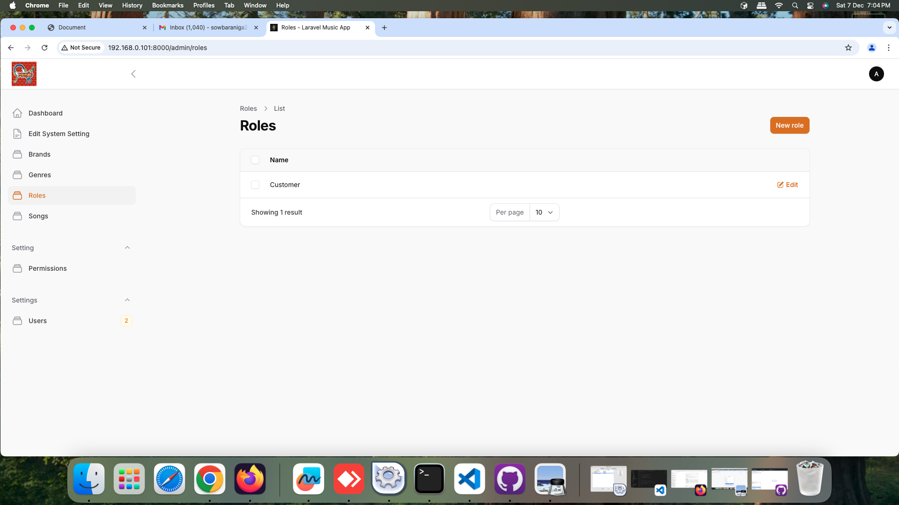
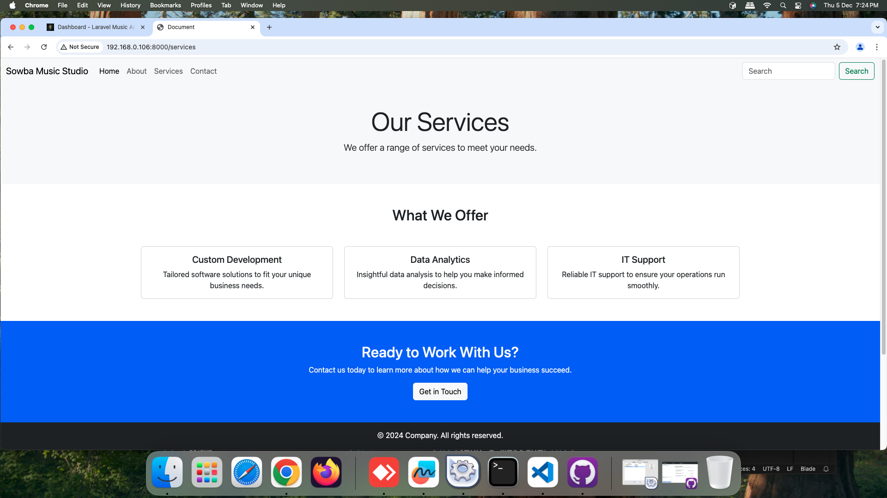
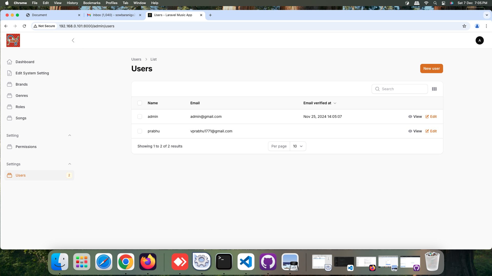
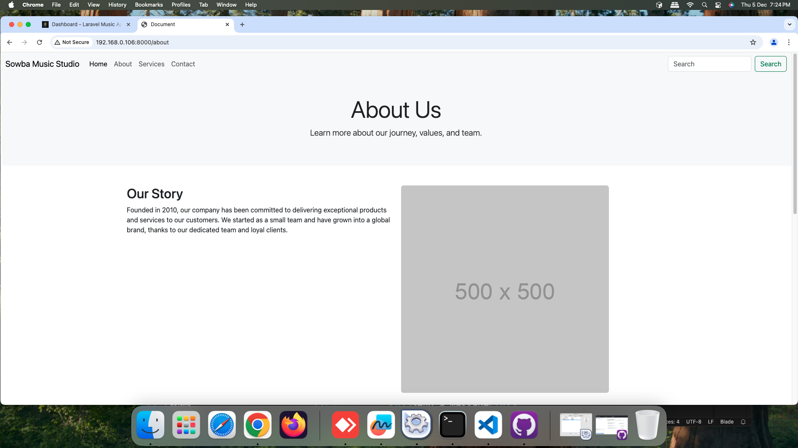
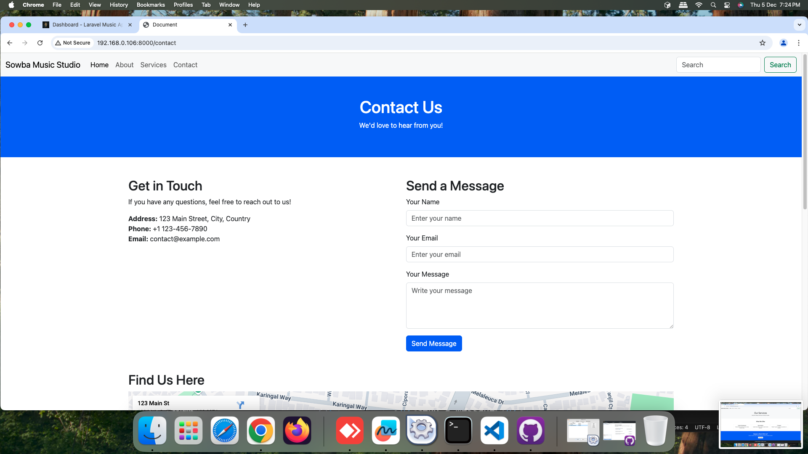
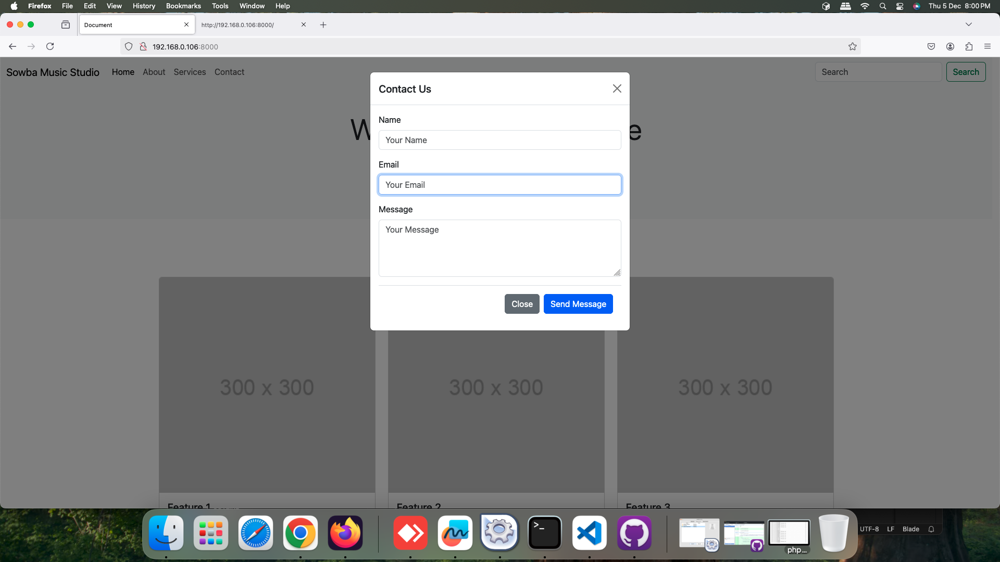
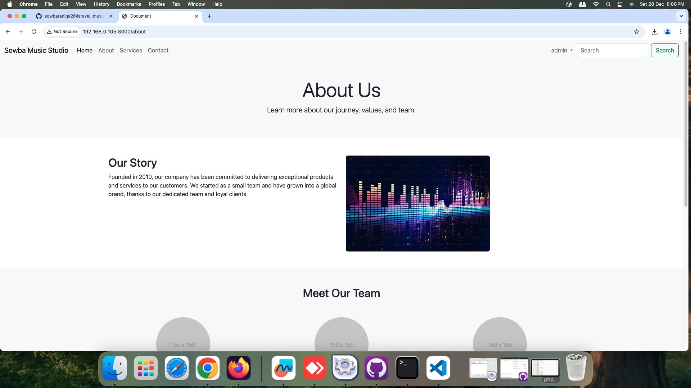

Setup Instructions
Prerequisites
Ensure you have PHP installed. You can download it from XAMPP.

Ensure you have composer installed. You can download it from composer.

Ensure you have visual studio code installed. You can download it from vs code.

Go to Terminal
1.Creating a Laravel Project

    composer create-project laravel/laravel laravel_music_app
